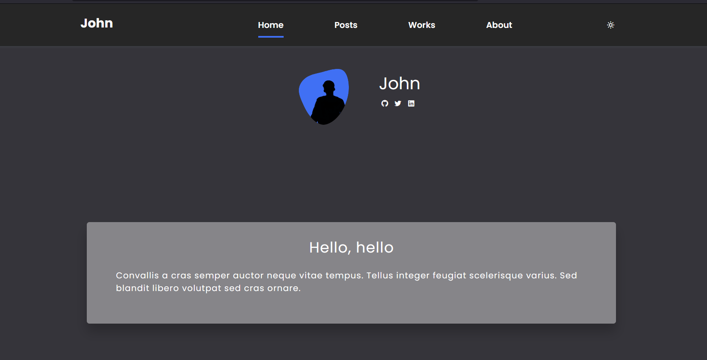
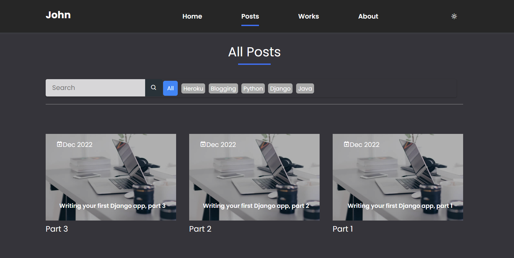
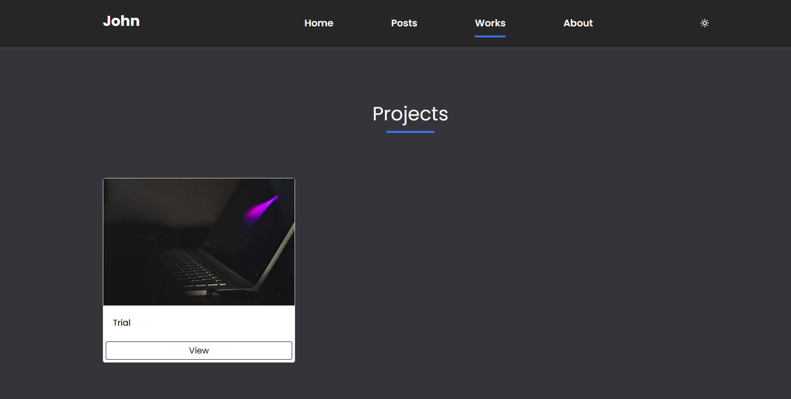
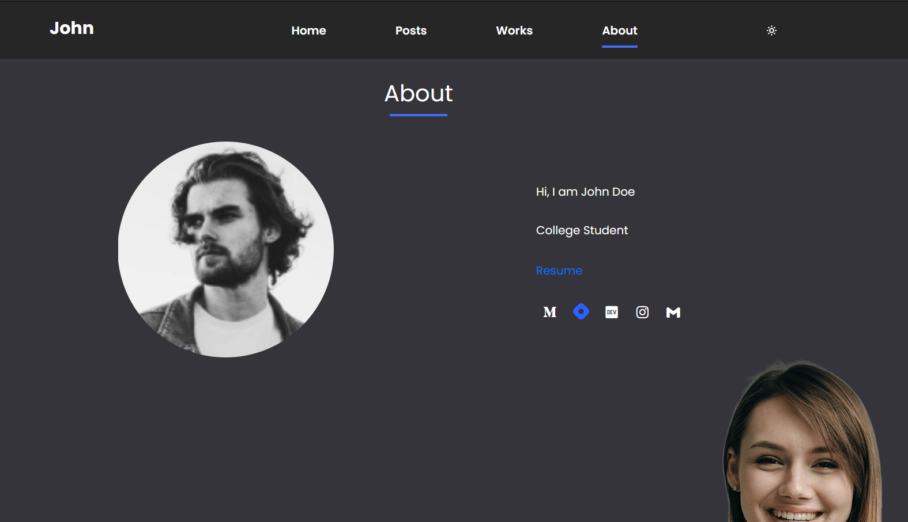
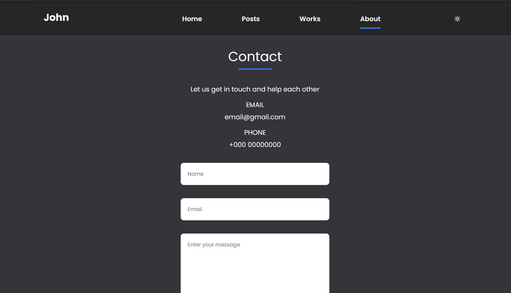

## Django Template

# Installation
* 1 - git clone https://github.com/Ugyenwangdi/Blog-Portfolio-website.git
* 2 - create a virtual environment and activate
*  - pip install virtualenv
*  - virtualenv envname
*  - envname\scripts\activate
* 3 - cd into project "cd Wulfi-railway"
* 4 - pip install -r requirements.txt
* 5 - python manage.py runserver

# Features
* Write blog posts
* Display blog posts
* Show projects
* Search posts by categories/tags
* Update profile/details

# Tech Stack
* Django
* HTML
* CSS
* ckeditor

# Home Page
  

# Posts Page
  

# Projects Page
  

# About
  

# Contact
  

